# PMO Controls Lab — Enterprise Portfolio Governance Environment

**Essam Afifi, PMP, MSc** · Portfolio & PMO Professional · Toronto, ON (open to remote/hybrid)

[](https://github.com/essamun/pmo-controls-lab)
[](https://github.com/essamun/pmo-controls-lab)
[](https://github.com/essamun/pmo-controls-lab)
[](https://github.com/essamun/pmo-controls-lab)

---

## What This Is

This is a self-directed, end-to-end PMO controls environment built to demonstrate active, current portfolio governance capability — not a tutorial project.

It mirrors the real PMO work I did at **CIBC** and **Markel Insurance** in Canada: intake governance, project controls, resource capacity planning, escalation management, and executive reporting — built from first principles and documented as a fully navigable portfolio artefact.

**Fictional organization:** Northgate Financial Group (NFG) — a mid-size Canadian financial institution  
**Portfolio:** 10 concurrent projects across IT, Compliance, Digital, and Infrastructure  
**Report anchor date:** February 28, 2026 (fixed — see [Why the Date is Fixed](#why-the-date-is-fixed))

> Full working files (Excel register with formulas, Power BI `.pbix` dashboard) are available upon request for interview or assessment purposes.

---

## Table of Contents

- [What This Demonstrates](#what-this-demonstrates)
- [Portfolio at a Glance](#portfolio-at-a-glance)
- [Phase 1 — Intake Governance & Stage Gates](#phase-1--intake-governance--stage-gates)
- [Phase 2 — Project Controls & Power BI Dashboard](#phase-2--project-controls--power-bi-dashboard)
- [Phase 3 — Resource & Capacity Planning](#phase-3--resource--capacity-planning)
- [Phase 4 — Executive PMO Pack & Automation](#phase-4--executive-pmo-pack--automation)
- [Why the Date is Fixed](#why-the-date-is-fixed)
- [Files in This Repo](#files-in-this-repo)
- [Roadmap](#roadmap)
- [Background](#background)

---

## What This Demonstrates

| Capability | Artefact |
|---|---|
| Demand management & portfolio intake | Intake Register · Prioritization Matrix · Governance workflow |
| Stage gate methodology | Gates 0–3 checklists with criteria and evidence requirements |
| Project controls (schedule, cost, RAG) | Excel KPI register · 7 calculated KPIs · Formula-driven RAG |
| Escalation governance | Escalation Log (6 entries) · Decisions Required Log (3 items) |
| Resource & capacity planning | Role-based capacity model · Overload % · Bench capacity |
| Executive reporting | 4-page Power BI dashboard · 3-slide SteerCo pack |
| PMO documentation | PMO Methodology Brief · SteerCo Resource Memo |
| Automation | Power Automate: weekly PM reminder + monthly PDF export |

---

## Portfolio at a Glance

10 projects · $12.45M baseline · Report date: Feb 28, 2026

| ID | Project | Baseline $K | Forecast $K | Sched Var (wks) | RAG |
|---|---|---|---|---|---|
| P001 | CRM Platform Upgrade | 850 | 875 | −6.3 | N/A — Under Review |
| P002 | Data Centre Migration | 2,500 | 2,500 | 0.0 | N/A — Submitted |
| P003 | Basel IV Compliance | 1,200 | 1,280 | −4.3 | 🟡 AMBER |
| P004 | HR Self-Service Portal | 420 | 420 | 0.0 | N/A — Under Review |
| P005 | Enterprise Risk Dashboard | 680 | 720 | −8.7 | 🔴 RED |
| P006 | Branch Network Refresh | 3,200 | 3,200 | 0.0 | ⬜ ON HOLD |
| P007 | Mobile Banking App v3 | 1,100 | 1,150 | −1.9 | 🟡 AMBER |
| P008 | Finance Reporting Auto. | 390 | 375 | +2.4 | 🟢 GREEN |
| P009 | Vendor Management System | 310 | 310 | 0.0 | N/A — Submitted |
| P010 | Cloud Infrastructure Ph.1 | 1,800 | 1,900 | −8.6 | N/A — Under Review |

**Portfolio cost variance: ~+$280K overrun (~5.8% above baseline) — Amber threshold. Three open SteerCo decisions (D001–D003) address root causes.**

---

## Phase 1 — Intake Governance & Stage Gates

**The governance question this solves:** How does a project request enter the portfolio through a controlled, auditable process — rather than informally based on whoever shouts loudest?

Every initiative at NFG passes through a formal intake register with mandatory fields, a prioritization scoring model, and a four-gate approval process before receiving budget authorization.

### Prioritization Model: Priority Score = Impact × (6 − Risk)

Regulatory projects (Basel IV) bypass scoring entirely — non-compliance carries OSFI penalty risk that outweighs any portfolio optimization model.

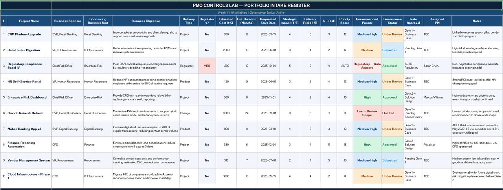
*Intake Register — 10 projects, all mandatory fields populated, governance statuses confirmed*

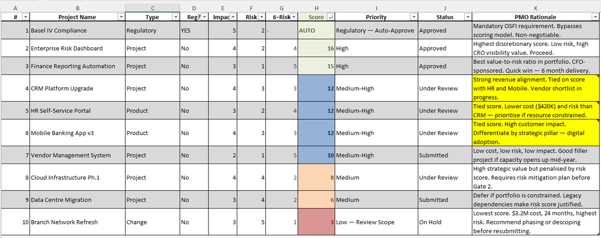
*Prioritization Matrix — formula-driven scoring, Basel IV regulatory auto-approval shown*

### Stage Gate Model

Four gates (0–3) with defined criteria and evidence requirements at each threshold. No project proceeds without PMO sign-off on the checklist. This creates an audit trail and prevents informal project starts.

| Gate | Name | Key Criteria |
|---|---|---|
| Gate 0 | Idea Submission | Sponsor identified, strategic alignment stated, rough cost estimate |
| Gate 1 | Business Case Approval | Cost estimate reviewed by Finance, risk register initiated, PMO scored |
| Gate 2 | Project Initiation | PM assigned, baseline locked, team confirmed, steering committee briefed |
| Gate 3 | Go-Live Readiness | UAT signed off, training complete, rollback plan approved, comms sent |

---

## Phase 2 — Project Controls & Power BI Dashboard

**The governance question this solves:** How do executives know — at any moment — which projects are in trouble, by how much, and what is being done about it?

### Excel Register — 7 Calculated KPIs

Every KPI is formula-driven. No manually coloured cells. The register uses a fixed Report Date Anchor cell (`Y2 = Feb 28, 2026`) instead of `TODAY()` — see [Why the Date is Fixed](#why-the-date-is-fixed).

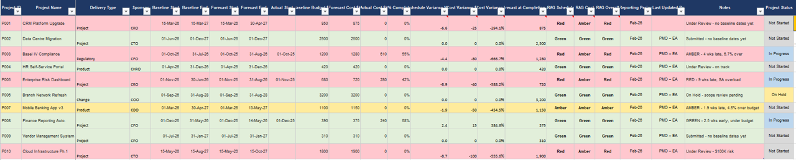
*Project register — 10 projects, RAG columns, and KPI formula bar visible*

### Power BI Dashboard — Page 1: Portfolio Delivery Performance

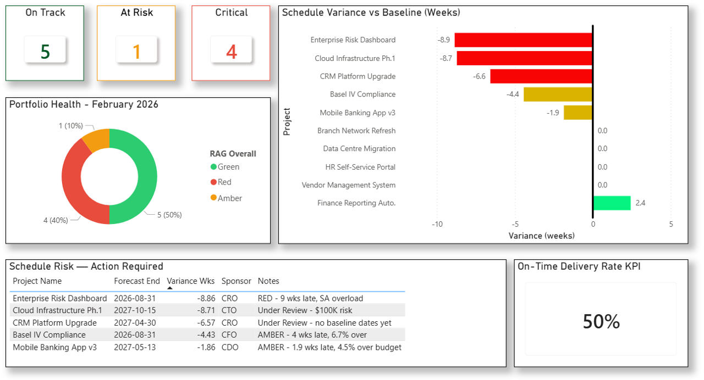
*Full portfolio health overview — RAG distribution, schedule variance, delivery confidence indicators*

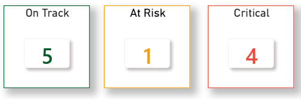
*RAG status cards — 1 Green, 2 Amber, 4 Red (of active projects)*

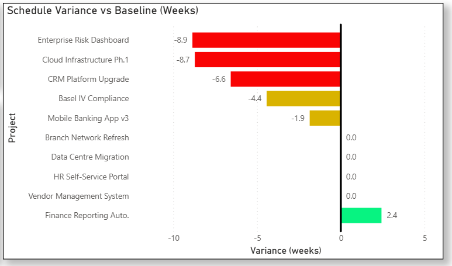
*Schedule variance by project — P005 Enterprise Risk Dashboard at −9 weeks*

### Power BI Dashboard — Page 2: Financial Controls

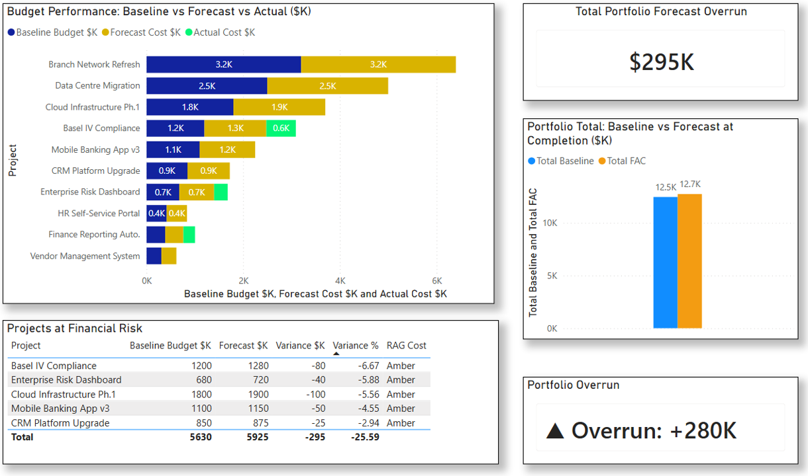
*Financial controls page — baseline vs forecast, cost variance %, portfolio overrun summary*

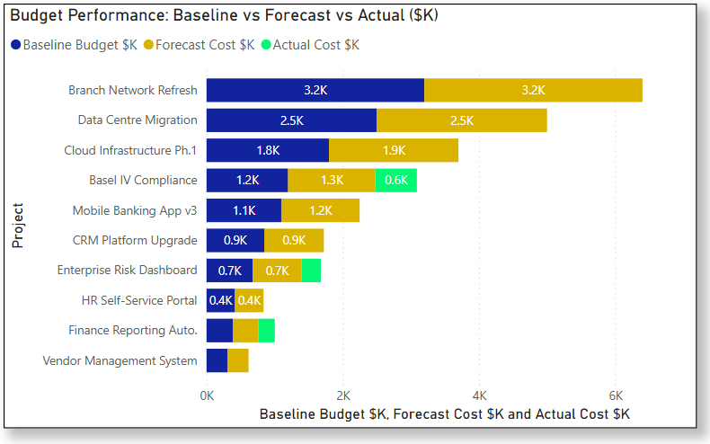
*Portfolio cost variance card — ~$280K overrun, Amber threshold (5.8% above baseline)*

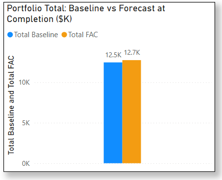
*Baseline vs forecast by project — P010 Cloud Infrastructure carrying the largest single risk at −$100K*

### Power BI Dashboard — Page 3: Governance & Escalation Log

The financial page shows where the problems are. The escalation page shows what is being done about them. These are two different governance questions — they belong on two separate pages.

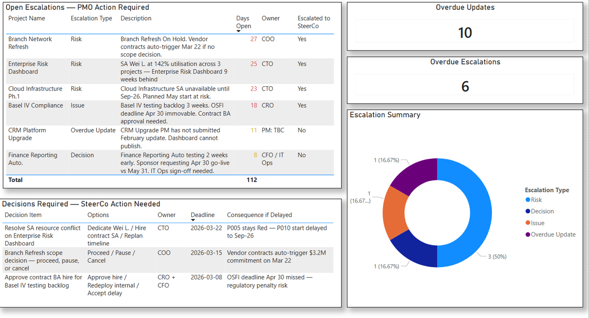
*Full governance page — open escalations, days open, SteerCo flags*

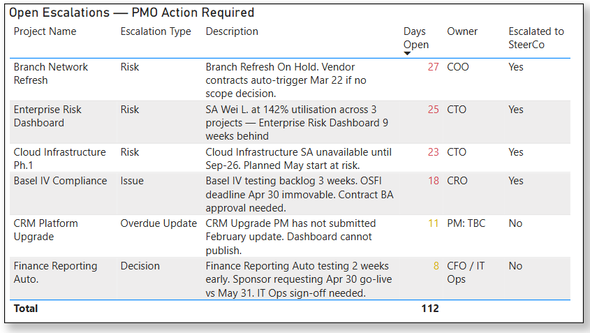
*Escalation Log — E001–E006, all 6 entries, days open calculated from Feb 28 anchor*

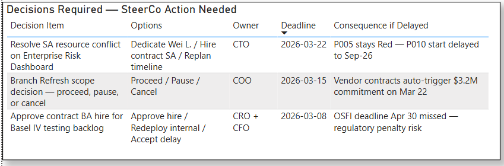
*Decisions Required — D001, D002, D003 with owners, deadlines, and consequences*

### Escalation Log Summary

| ID | Project | Type | Owner | Days Open | SteerCo |
|---|---|---|---|---|---|
| E001 | P005 Enterprise Risk | Risk — SA at 142% utilization | CTO | 25 | Yes |
| E002 | P003 Basel IV | Issue — testing backlog, OSFI deadline immovable | CRO | 18 | Yes |
| E003 | P001 CRM Upgrade | Overdue Update — PM not submitted Feb update | PM: TBC | 11 | No |
| E004 | P010 Cloud Infra | Risk — SA unavailable until Sep-26 | CTO | 23 | Yes |
| E005 | P008 Finance Reporting | Decision — early go-live request, IT Ops sign-off needed | CFO / IT Ops | 8 | No |
| E006 | P006 Branch Refresh | Risk — vendor contracts auto-trigger Mar 22 | COO | 27 | Yes |

---

## Phase 3 — Resource & Capacity Planning

**The governance question this solves:** Does the organization actually have the people to deliver this portfolio — and if not, where is the constraint?

Most PMO environments report on projects already in flight. This model answers the harder question: is the portfolio even deliverable given available capacity?

### Role-Based Capacity Model

12 resources across 6 roles. Capacity is modelled by role, not individual — this is standard practice in Canadian enterprise PMOs.

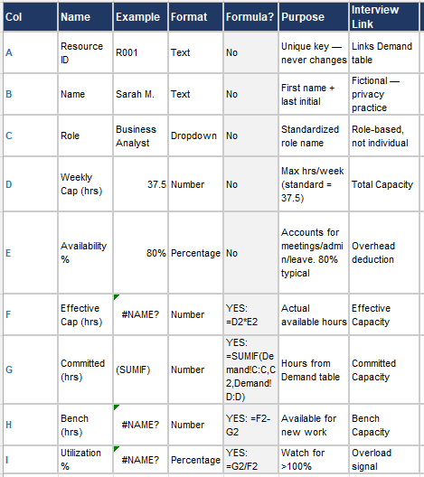
*Resource Model — 12 resources, Effective Capacity, Committed (SUMIF from Demand sheet), Bench, Utilization %*

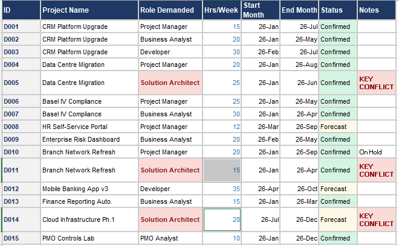
*Demand sheet — 15 demand rows, D005/D011/D014 Solution Architect conflicts highlighted*

### Capacity Summary — The Portfolio Risk Signal

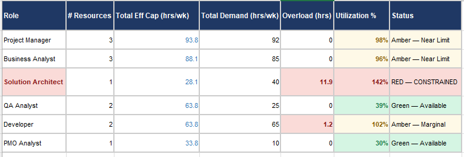
*Capacity Summary — 6 roles aggregated, Solution Architect overload immediately visible*

| Role | Resources | Eff Cap (hrs/wk) | Demand (hrs/wk) | Utilization | Status |
|---|---|---|---|---|---|
| Project Manager | 3 | 93.8 | 92 | 98% | 🟡 Near Limit |
| Business Analyst | 3 | 88.1 | 85 | 96% | 🟡 Near Limit |
| **Solution Architect** | **1** | **28.1** | **40** | **142%** | **🔴 CONSTRAINED** |
| QA Analyst | 2 | 63.8 | 25 | 39% | 🟢 Available |
| Developer | 2 | 63.8 | 65 | 102% | 🟡 Marginal |
| PMO Analyst | 1 | 33.8 | 10 | 30% | 🟢 Available |

### Power BI Dashboard — Page 4: Resource & Capacity

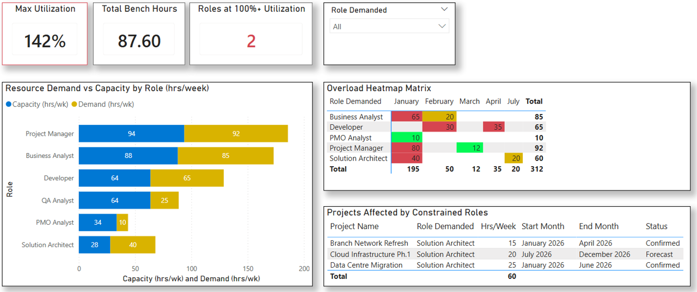
*Full resource and capacity page — demand vs capacity bar chart, overload heatmap, constrained role cards*

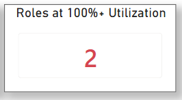
*Solution Architect bar — 142% utilization, 11.9 hrs/week overload clearly visible*

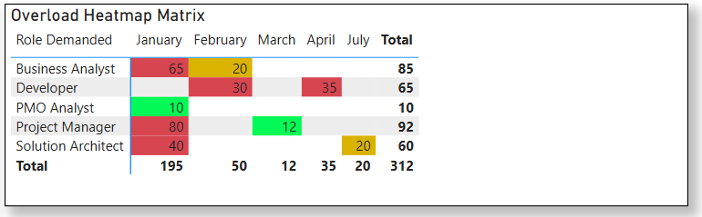
*Role × month overload heatmap — Jan–Apr peak conflict period highlighted*

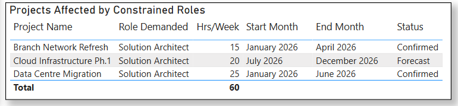
*Projects competing for Solution Architect — D005, D011, D014 all active simultaneously*

### SteerCo Resource Memo

When the capacity model identified the Solution Architect overload, the PMO produced a one-page governance memo for the steering committee — three options analysed, a recommendation, and an explicit March 22 decision deadline.

> *The PMO's job is to surface the conflict with options, not to make the resourcing decision unilaterally.*

See [`docs/NFG_SteerCo_Memo_Resource_Feb26.pdf`](docs/NFG_SteerCo_Memo_Resource_Feb26.pdf)

---

## Phase 4 — Executive PMO Pack & Automation

**The governance question this solves:** How does the PMO turn portfolio data into a 90-second executive briefing that drives governance decisions — not just information consumption?

### PMO Methodology Brief

A formal one-page document describing the NFG Enterprise PMO's operating model — purpose, governance structure, reporting cycle, escalation path, delivery standards, and tools. Version 1.0, February 2026.

> *Having a printed Methodology Brief in an interview demonstrates that you think about PMO as a system, not just a collection of tasks.*

See [`docs/NFG_PMO_Methodology_Brief_v1.0.pdf`](docs/NFG_PMO_Methodology_Brief_v1.0.pdf)

### 3-Slide Executive Pack

Designed to be read in 90 seconds before a SteerCo meeting and to drive a 60-minute governance conversation.


*Slide 1 — Portfolio Health Overview: 10 projects, RAG distribution, KPI cards, key movements*


*Slide 2 — Delivery & Financial Outlook: schedule risk, cost variance, top 3 active risks*


*Slide 3 — Decisions Required: three governance decisions, options analysed, owners named, deadlines explicit*

**Slide 3 — Decisions Required**

| # | Project | Decision | Owner | By | Consequence |
|---|---|---|---|---|---|
| D001 | P006 Branch Refresh | Proceed / pause / cancel — vendor contracts auto-trigger $3.2M Mar 22 | COO | Mar 15 | $3.2M committed without scope decision |
| D002 | P003 Basel IV | Approve contract BA to clear testing backlog before OSFI Apr 30 | CRO + CFO | Mar 8 | OSFI penalty risk $500K+ |
| D003 | P005 Enterprise Risk | Contract SA $80K OR defer Cloud Infrastructure 8 weeks | CTO | Mar 22 | Both projects compete for Wei L. from April |

See [`docs/NFG_Executive_PMO_Pack_Feb2026.pdf`](docs/NFG_Executive_PMO_Pack_Feb2026.pdf)

### Power Automate — Two Automations

| Flow | Trigger | Purpose | Time Saved |
|---|---|---|---|
| Weekly PM Status Reminder | Every Monday 8:00am | Automated status chase — removes manual PM follow-up | ~45 min/week |
| Monthly Dashboard Export | Last day of month, 4:00pm | Power BI → PDF → archive email | ~30 min/month |

*Before automation: ~3 hours to produce the weekly pack manually. After: ~45 minutes.*

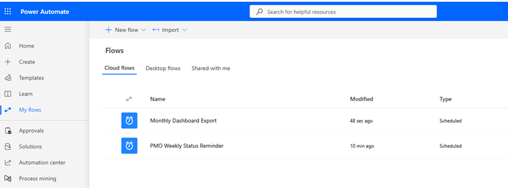
*Power Automate — two active flows in the PMO lab environment*

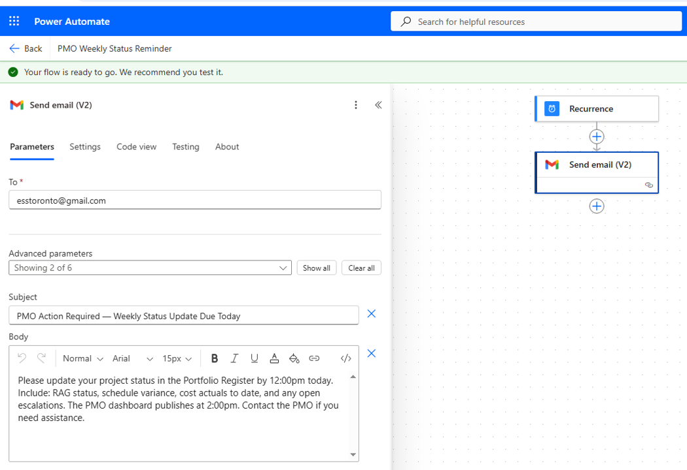
*Flow 1 — Scheduled trigger (every Monday 8:00am) → Gmail send email action*

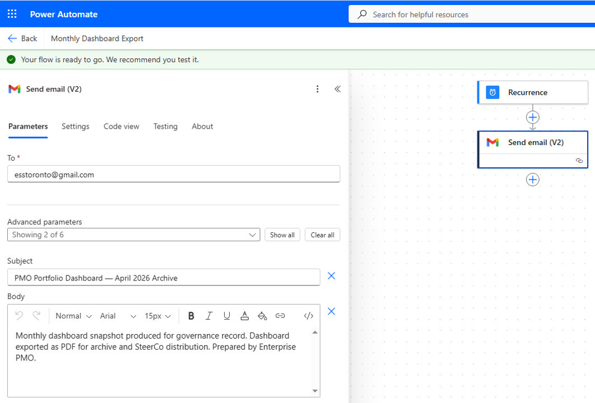
*Flow 2 — Scheduled trigger (monthly) → Gmail archive email action*

---

## Why the Date is Fixed

The register uses a hardcoded **Report Date Anchor cell** (`Feb 28, 2026`) instead of `TODAY()`.

If `TODAY()` were used, every formula would recalculate based on the current date — and RAG distributions, schedule variances, and days-open calculations would all drift meaninglessly. The anchor freezes the portfolio at a specific reporting moment, producing identical results whenever the file is opened.

In real enterprise PMO environments, report dates are always fixed per reporting period — never dynamic. **This is a governance control, not a workaround.** In Power BI, the `Overdue Updates` DAX measure compares against `DATE(2026,2,28)` for the same reason.

---

## Files in This Repo

```
pmo-controls-lab/
├── README.md
├── screenshots/                               ← All Power BI, Excel, and PowerPoint visuals
│   ├── pbi_page1_portfolio_overview.png
│   ├── pbi_page1_rag_cards.png
│   ├── pbi_page1_schedule_chart.png
│   ├── pbi_page2_financial_controls.png
│   ├── pbi_page2_cost_variance_card.png
│   ├── pbi_page2_baseline_vs_forecast.png
│   ├── pbi_page3_governance.png
│   ├── pbi_page3_escalation_table.png
│   ├── pbi_page3_decisions_log.png
│   ├── pbi_page4_resource_capacity.png
│   ├── pbi_page4_sa_overload.png
│   ├── pbi_page4_heatmap.png
│   ├── pbi_page4_constrained_projects.png
│   ├── excel_register_kpi_view.png
│   ├── excel_escalation_log.png
│   ├── excel_decisions_required.png
│   ├── excel_resource_model.png
│   ├── excel_capacity_summary.png
│   ├── excel_demand_sheet.png
│   ├── excel_intake_register.png
│   ├── excel_prioritization_matrix.png
│   ├── pptx_slide1_portfolio_health.png
│   ├── pptx_slide2_delivery_financial.png
│   └── pptx_slide3_decisions_required.png
├── docs/
│   ├── NFG_SteerCo_Memo_Resource_Feb26.pdf    ← 1-page governance memo
│   ├── NFG_PMO_Methodology_Brief_v1.0.pdf     ← PMO operating model document
│   └── NFG_Executive_PMO_Pack_Feb2026.pdf     ← 3-slide executive pack
├── automation/
│   ├── PowerAutomate_Flows_Overview.png       ← Active flows list
│   ├── PowerAutomate_Flow1_WeeklyReminder.png ← Weekly PM status reminder flow
│   └── PowerAutomate_Flow2_MonthlyExport.png  ← Monthly dashboard export flow
└── dashboard/
    └── pbi_dashboard_full_export.pdf          ← All 4 pages exported
```

> **Working files** (Excel register with formulas, Power BI `.pbix`) are available upon request for interview or assessment purposes.

---

## Roadmap

- [x] **Portfolio intake & stage gate model** — demand register, prioritization matrix, gate checklists ✅
- [x] **Project controls & Power BI dashboard** — KPI register, escalation log, 4-page dashboard ✅
- [x] **Resource & capacity planning** — role-based model, overload analysis, SteerCo memo ✅
- [x] **Executive PMO pack** — 3-slide SteerCo pack, PMO Methodology Brief ✅
- [x] **Power Automate flows** — weekly reminder and monthly export screenshots added ✅
- [ ] **Smartsheet integration** — migrate intake register to Smartsheet with automated approval workflows
- [ ] **Jira intake board** — live demand management board with workflow screenshots
- [ ] **Power BI Service publish** — dashboard published to Power BI Service with scheduled refresh
- [ ] **Additional portfolio scenarios** — mid-year reforecast cycle, portfolio rebalancing decision, stage gate hold scenario

---

## Background

I am a PMP-certified PMO professional with an MSc and enterprise PMO experience at **CIBC** (Telephone Banking portfolio) and **Markel Insurance** in Canada, followed by an international portfolio engagement.

This project was built to demonstrate active, current PMO capability — and to close the visible gap between my last Canadian role and today. Every artefact here maps directly to what a PMO Analyst or PMO Coordinator does in a Canadian enterprise environment.

**Connect:** [LinkedIn](https://linkedin.com/in/essamafifi) · [GitHub](https://github.com/essamun)

---

*Fictional organization and data. All PMO processes, governance models, and controls frameworks reflect real enterprise practice based on CIBC, Markel, and international portfolio experience.*
